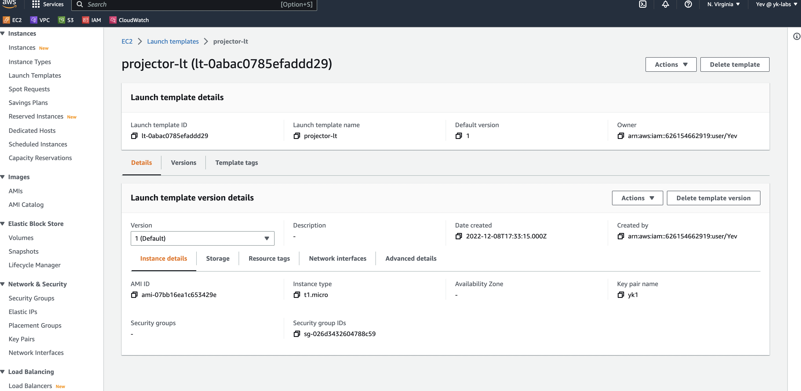
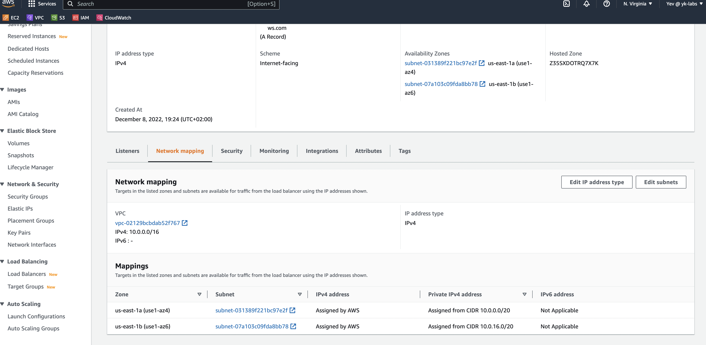
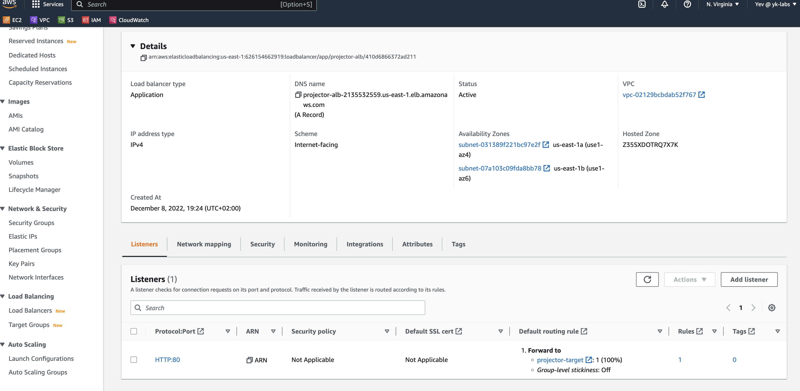
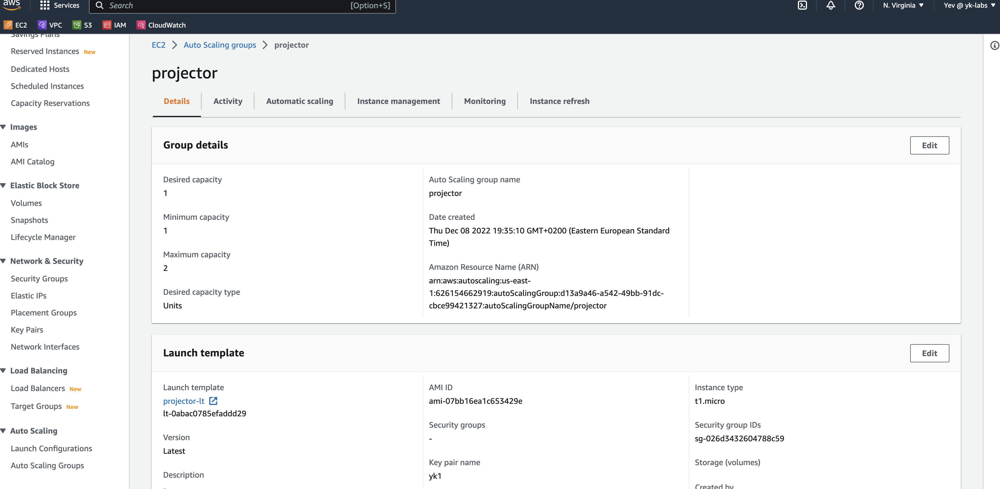
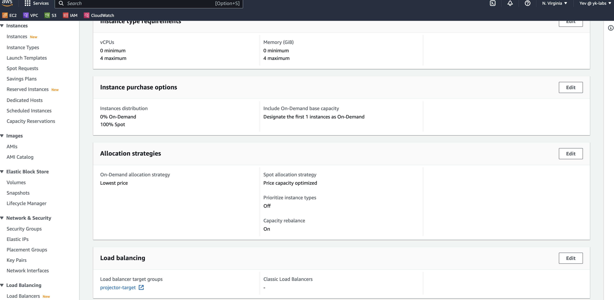
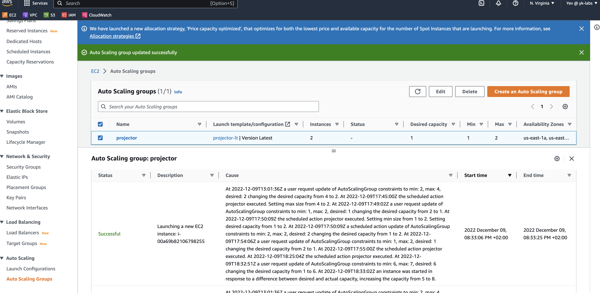
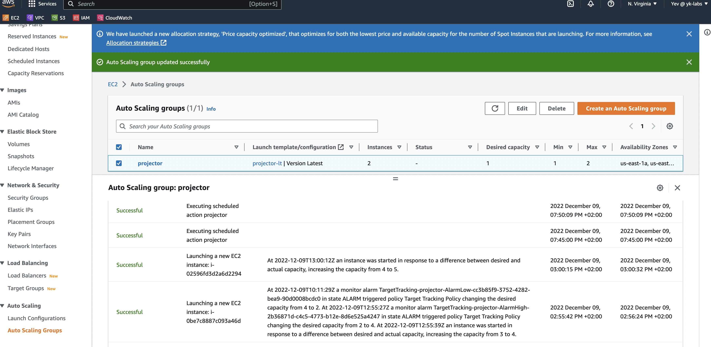
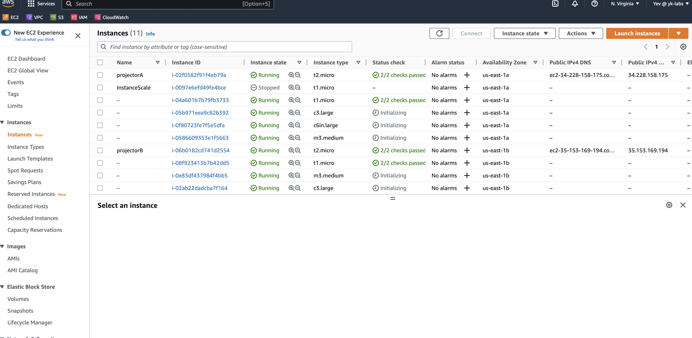

# HSA L25 AWS: Autoscale groups

 - Create autoscale group that will contain one ondemand instance and will scale on spot instances.
 - Set up scaling policy based on AVG CPU usage
 - Set up scaling policy based on requests amount that allows non-linear growth

 
##Step to setup:

1. Setup VPS
2. Setup Subnets and route tables with Internet Gateway
3. Setup Security Group
4. Create Launch Template
5. Create Application Load Balancer
6. Reserve spots fleet
7. Create Autoscale Group
8. siege -b1  -c100  -v -t500s http://projector-alb-2135532559.us-east-1.elb.amazonaws.com

