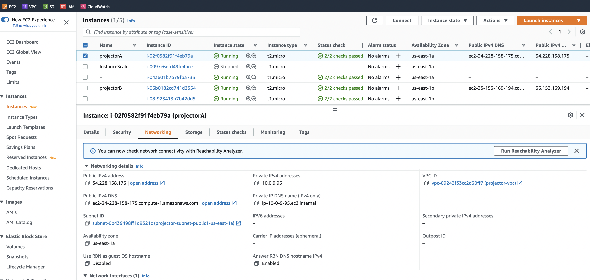
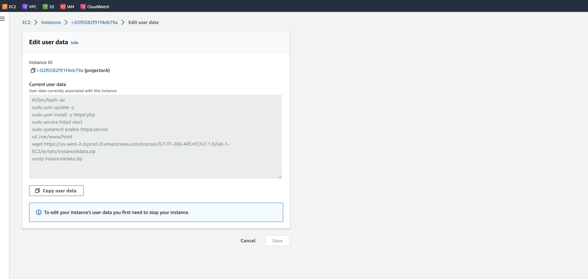

# HSA L23 AWS: EC2 and Load Balancer

 - Create 2 micro instances in AWS
 - Setup classic load balancer and assign instances to it
 
##Step to setup:

1. Setup VPS
2. Setup Subnets and route tables with Internet Gateway
3. Setup Security Group
4. Create 2 Instance with UserData
5. Create Classic Load Balancer and add instance

