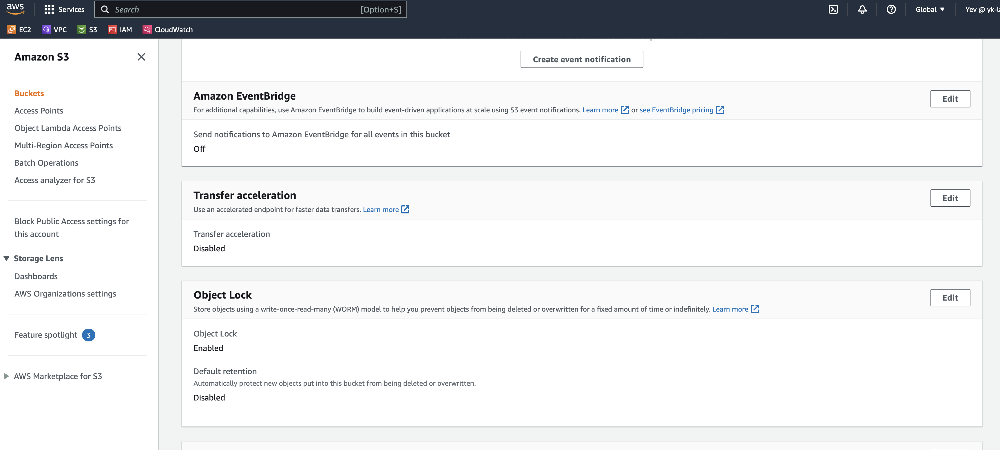
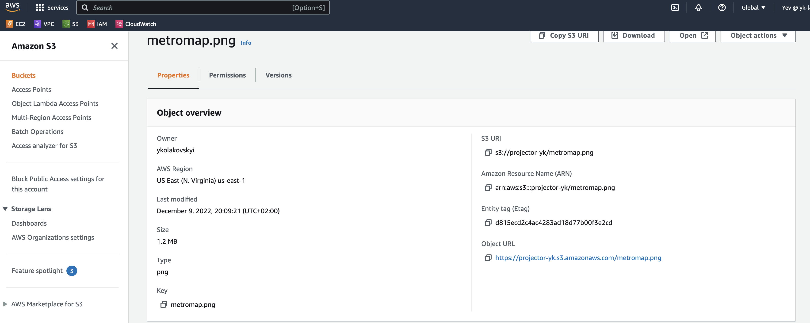
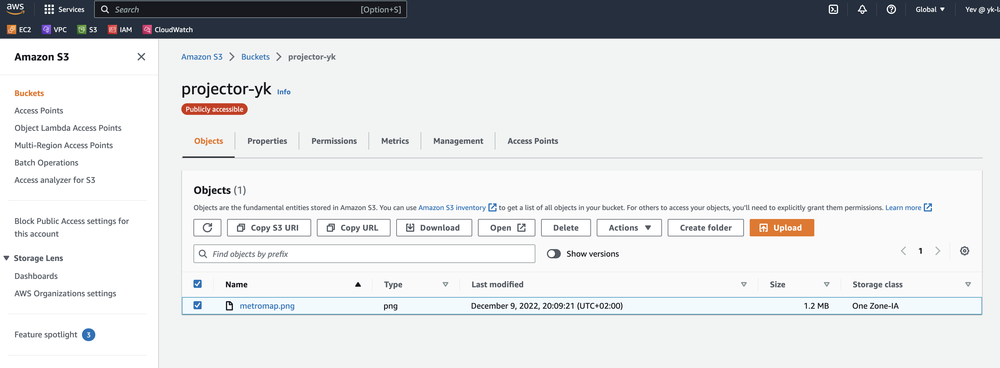
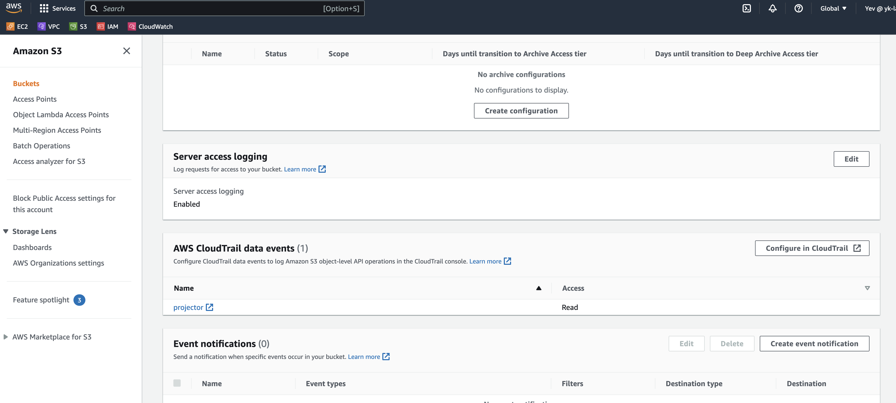
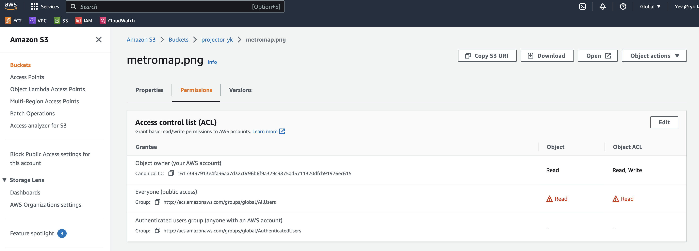
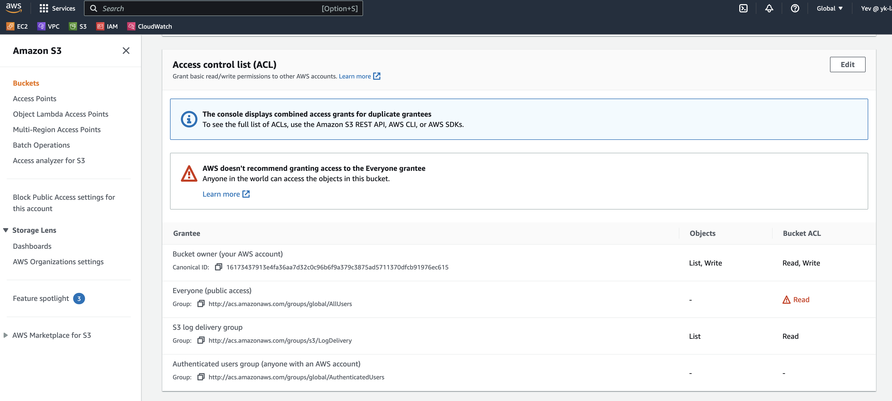
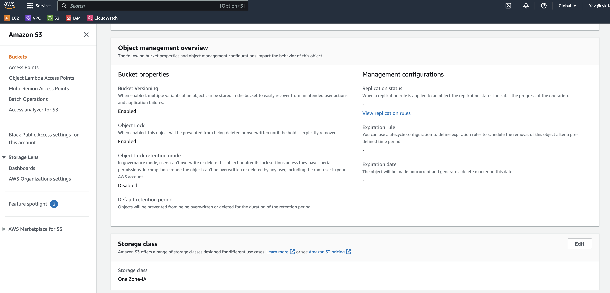
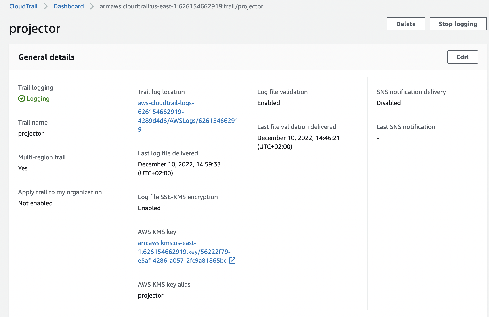
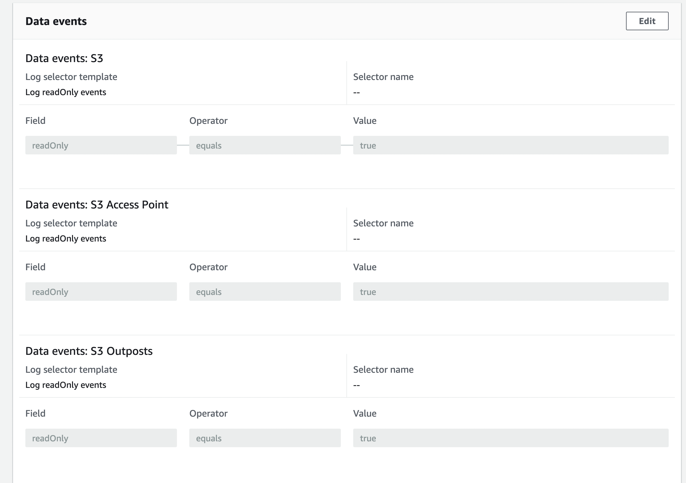
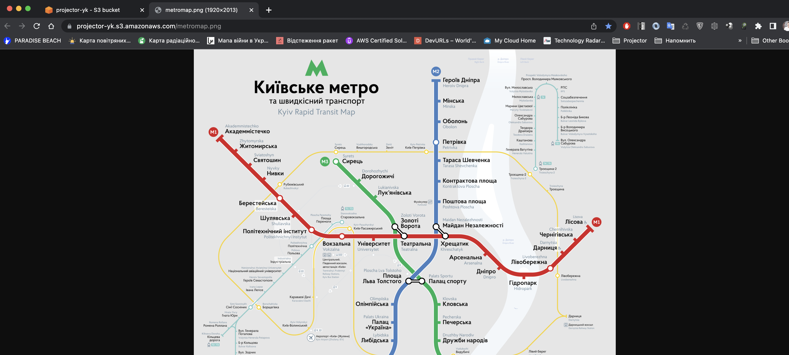

# HSA L24 AWS: S3: Simple Storage

 - Create bucket where objects can’t be modified and all requests are logged.
 
##Step to setup:

1. Create bucket with WORM lock
2. Upload file
3. Settings ACL
4. Enable logging. See file `2022-12-10-10-42-41-8E6806002FED3321.txt`
5. Enable ClodTrail logging. See file `626154662919_CloudTrail_us-east-1_20221210T1310Z_DyYL104egvBhzNSS.json`

